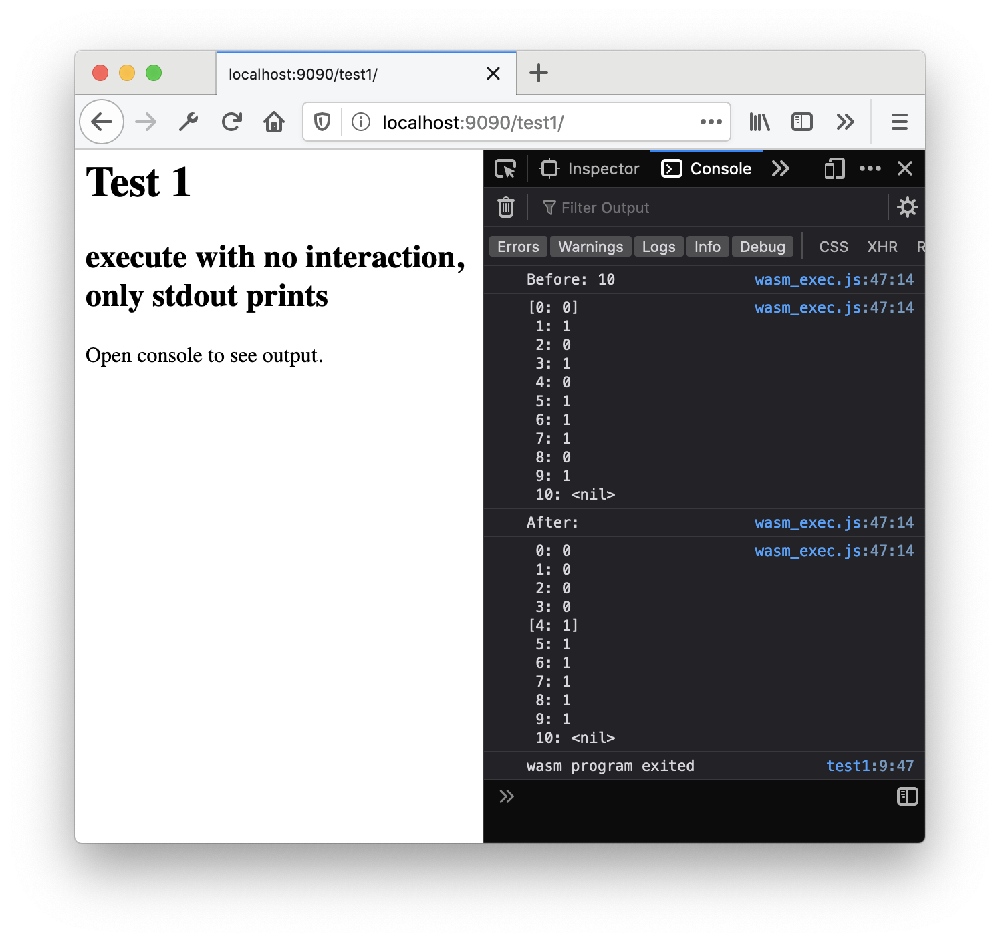
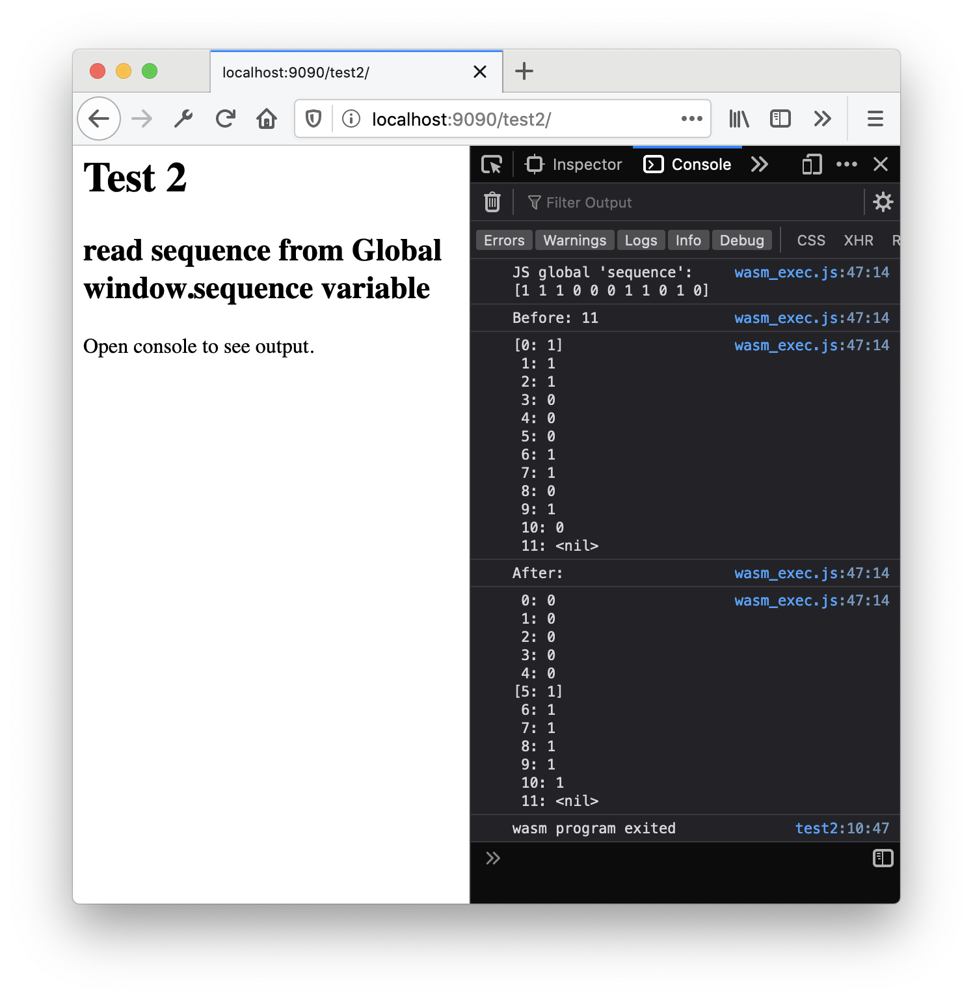
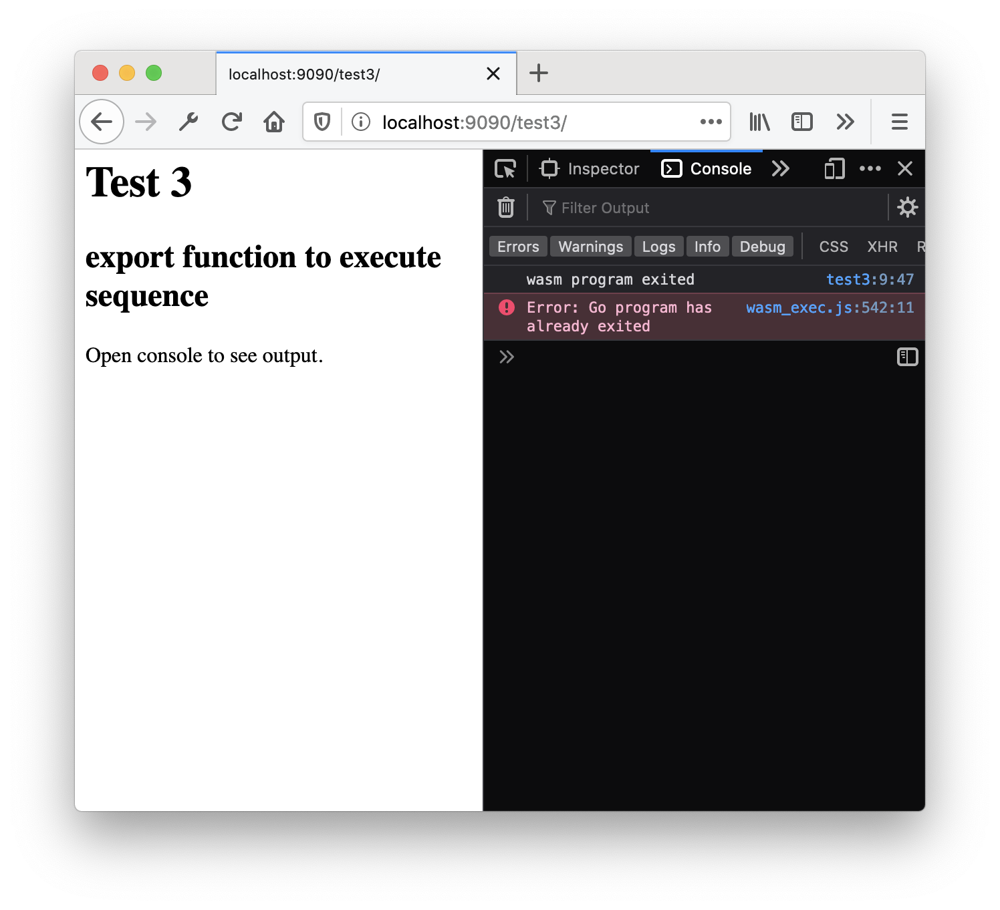
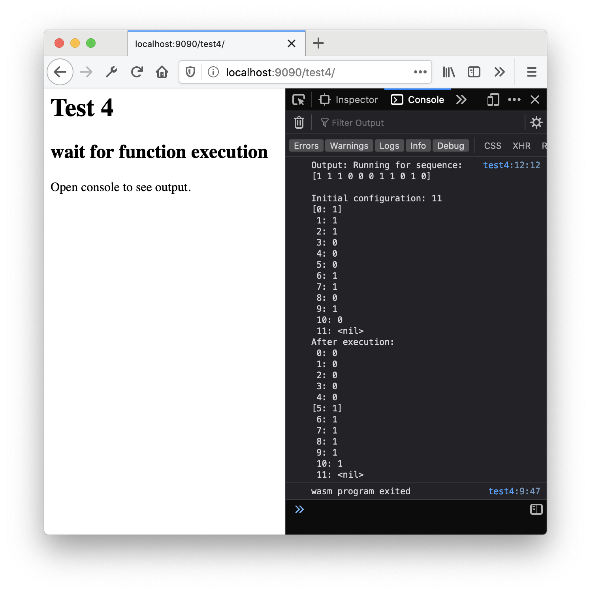

# Turing

A simple turing machine written in Go. The main objective of this project is not the turing machine, but to test Go's web assembly.
This project and this document will grow as I do more tests on web assembly.

- [Turing](#turing)
  - [Quick turing machine explanation](#quick-turing-machine-explanation)
  - [Execution](#execution)
  - [Web Assembly basics](#web-assembly-basics)
    - [Compiling web assembly](#compiling-web-assembly)
    - [Executing web assembly](#executing-web-assembly)
  - [Tests](#tests)
    - [Test 1: Simple execution with no interaction](#test-1-simple-execution-with-no-interaction)
    - [Test 2: Reading the sequence as a global variable](#test-2-reading-the-sequence-as-a-global-variable)
    - [Test 3: Exporting a function to execute](#test-3-exporting-a-function-to-execute)
    - [Test 4: Wait for function execution](#test-4-wait-for-function-execution)
    - [Test 5: Uint8Array](#test-5-uint8array)
    - [TODO](#todo)
  - [Licensing](#licensing)

## Quick turing machine explanation

Turing package is just a simple turing machine that will be used by javascript.
A machine has state, a head and a program. The head attaches to a tape and can move, read and write the tape. The program has operations that the machine executes based on current state and the symbol under head. A execution step consists into replacing the current symbol, move the head and change the machine state.

## Execution

`make run` opens a file server on port 9090
where you can navigate to the tests.

```sh
make run
```

## Web Assembly basics

Web Assembly is a binary instruction format for a stack based virtual machine,
and the principal browser vendors can run it. With web assembly we can write
code in other language than javascript and compile it to web assembly. Since
browsers vendors implement it with fast execution in mind, they usually run
faster than hand written javascript.

### Compiling web assembly

To compile web assembly, we need a main method and to set GOOS=js and GOARCH=wasm:

```shell
GOOS=js GOARCH=wasm go build -o ./wasm/main.wasm ./wasm/main.go
```

### Executing web assembly

To execute a wasm into the browser, we need to serve the wasm file and execute it within an HTML page.

```html
<html>
    <head>
        <meta charset="utf-8"/>
        <script src="wasm_exec.js"></script>
        <script>
            const go = new Go();
            WebAssembly.instantiateStreaming(fetch("main.wasm"), go.importObject).then((result) => {
                go.run(result.instance).then(() => console.log("wasm program exited"));
            });
        </script>
    </head>
    <body></body>
</html>
```

For go, we need a companion `wasm_exec.js` file, that we can get from Go's root with the following command:

```shell
cd wasm
cp "$(go env GOROOT)/misc/wasm/wasm_exec.js" .
```

To serve the files

## Tests

To understand wasm under go I am creating some simple tests and exploring step by step what I can do.

### Test 1: Simple execution with no interaction

[Test 1 files](wasm/test1)

The first test is just a simple execution of main, with everything inside it
and only print output.

As we can see after the execution, it runs and the output is written to the
console.


### Test 2: Reading the sequence as a global variable

[Test 2 files](wasm/test2)

For the second test, I wanted to use bindings to read global variables from
javascript. To do it I used the `syscall/js` package, which is the current go
package for js bindings.

The global javascript variable that we are going to use is window.sequence, set
 at line `7` of index.html as:

 ```javascript
    window.sequence = [1,1,1,0,0,0,1,1,0,1,0];
 ```

To obtain the variable, we use

```go
    js.Global().Get("sequence")
```

We need to make sure it is an array, so we use `InstanceOf` to verify it:

```go
    if !jsSequence.InstanceOf(js.Global().Get("Array")) {
        fmt.Printf("ERROR: sequence is not an Array: %v\n", jsSequence)
        return
    }
```

Since sequence is an array, we create a slice and fill it with a loop using `Index(i).Int()`
If `jsSequence` was not an array of ints, those calls would panic.

```go
    sequence := make([]turing.Symbol, jsSequence.Length())
    for i := range sequence {
        sequence[i] = jsSequence.Index(i).Int()
    }
```

The output was again on the console. As expected, we got the global
sequence from javascript:



### Test 3: Exporting a function to execute

[Test 3 files](wasm/test3)

In this test, we are going to try to export a function so javascript can call
the function instead of setting global variables.

To do it we will use `js.Global().Set(js.FuncOf())`, this will set a window global
variable as a go function.

`js.FuncOf()` refeives a function with two arguments, the first is the javascript
`this` Value, and the second an of arguments values. The function returns an `interface{}`,
that javascript receives as return value.

So we create a `runMachine` global variable, its first arg (`args[0]`) is the sequence,
and it returns the output as a string.

```go
js.Global().Set("runMachine", js.FuncOf(func(this js.Value, args []js.Value) interface{} {
       jsSequence := args[0]

        [...]

        builder := strings.Builder{}

        sequence := make([]turing.Symbol, jsSequence.Length())
        for i := range sequence {
            sequence[i] = jsSequence.Index(i).Int()
        }

        [...]

        tape := turing.NewInfiniteTape()
        tape.Set(0, sequence...)
        head.Attach(tape, 0)

        [...]

        err := machine.Run()

        [...]

        return builder.String()
    }))
```

To run it, I changed the javascript slightly:

```javascript
    WebAssembly.instantiateStreaming(fetch("main.wasm"), go.importObject).then((result) => {
        go.run(result.instance).then(() => console.log("wasm program exited"));
    }).then(() => {
        const output = runMachine([1,0,1,0]);
        console.log("Output:", output)
    })
```

In this way, we call runMachine after go.run is called, but as we can see when we
execute this program, we get the error `Go program has already exited.`.
So after main exits, you can't interact with the Go program anymore, which will guide
us to Test 4.



### Test 4: Wait for function execution

[Test 4 files](wasm/test4)

Since we can't finish the program before the execution, let's change main
to wait until the function was called. We can do it easily with a channel.

```go
    exit := make(chan struct{})

    js.Global().Set("runMachine", js.FuncOf(func(this js.Value, args []js.Value) interface{} {
        jsSequence := args[0]
        defer func() {
            exit <- struct{}{}
        }()

        ...
    }))

    <-exit
```

As we can see when executing test4, the program now works as expected.



### Test 5: Uint8Array

[Test 5 files](wasm/test5)

Test 5 uses CopyDataToGo and CopyDataToJs to copy UintArray data from
go and js. It receives an Uint8Array as parameters, runs the machine
and copies the tape data to this array at the end.

Since the tape is not expecting bytes, we have to internally create a Symbol
slice and copy each byte to it. The best option would be to have a tape with
byte array capacities, but for the purpose of this test, it is enough.

```go
js.Global().Set("runMachine", js.FuncOf(func(this js.Value, args []js.Value) interface{} {
    jsArr := args[0]
    ...
    byteSequence := make([]byte, jsArr.Length(), jsArr.Length())
    js.CopyBytesToGo(byteSequence, jsArr)

    sequence := make([]turing.Symbol, len(byteSequence), len(byteSequence))
    for i := range byteSequence {
        sequence[i] = byteSequence[i]
    }
    ...
    err := machine.Run()
    if err != nil {
        return fmt.Sprint("ERROR: error executing machine:", err.Error())
    }

    for i := range byteSequence {
        v, _ := tape.Get(i)
        byteSequence[i] = v.(byte)
    }
    js.CopyBytesToJS(jsArr, byteSequence)
    ...
}))
```

We also have to change the machine operations to cast the symbols to byte,
otherwise it mismatches the constant numbers 0 and 1 with the bytes.

### TODO

Next tests that I would like to try:

- Array return
- Object return
- Output on document
- DOM interaction from Go code
- "Parallel" function calls
- Multiple wasm program instances

## Licensing

```text
Copyright 2020, Geraldo Augusto Massahud Rodrigues dos Santos

Licensed under the Apache License, Version 2.0 (the "License");
you may not use this file except in compliance with the License.
You may obtain a copy of the License at

    http://www.apache.org/licenses/LICENSE-2.0

Unless required by applicable law or agreed to in writing, software
distributed under the License is distributed on an "AS IS" BASIS,
WITHOUT WARRANTIES OR CONDITIONS OF ANY KIND, either express or implied.
See the License for the specific language governing permissions and
limitations under the License.
```
